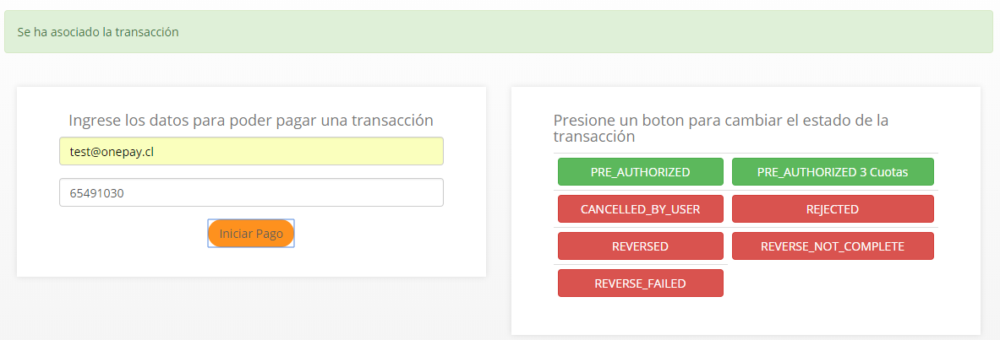

[](https://travis-ci.org/TransbankDevelopers/transbank-sdk-java-onepay-example)

# Proyecto de ejemplo Onepay para Transbank SDK Java

## Requerimientos

Para poder ejecutar el proyecto de ejemplo necesitas tener instalada las siguientes herramientas
en tu computador:

1. git ([como instalar git][git_install])
2. maven ([como instalar maven][maven_install])

[git_install]: https://git-scm.com/book/en/v2/Getting-Started-Installing-Git
[maven_install]: https://maven.apache.org/install.html

## Clonar repositorio

Primero deberas clonar este repositorio en tu computador:

````batch
git clone https://github.com/TransbankDevelopers/transbank-sdk-java-onepay-example.git
````

## Ejecutar ejemplo

```bash
cd transbank-sdk-java-onepay-example
mvn jetty:run
```

Luego visita http://localhost:8080 y verás la tienda de ejemplo. Desde tu computador podrás ver como se comporta Onepay en modalidad "WEB" desktop.

## Ejecutar tests automáticos

Debes tener corriendo el servidor web (según lo indicado más arriba) y luego
ejecutar:

```
mvn test -Dselenide.headless=false
```

Nota: debes tener Google Chrome instalado en tu computador.

## Compra de prueba
1. Desde la tienda de ejemplo.
2. Clic en el botón `Onepay QR DIRECTO` o `Onepay QR CHECKOUT`
3. Esperar a que se genere un nuevo código QR.
4. Utilizando un lector de QR puedes identificar el OTT (identificador simplificado y único de la transacción) que se utiliza en el simulador de pago.
5. Pagar/Rechazar utilizando el simulador de pagos

## Simulador de pagos.
Este simulador permite realizar pruebas de **pagos** y **rechazos** con distintos códigos, simulando las acciones del usuario en la aplicación de **Onepay**. 

Este simulador apunta al ambiente de Prueba que puede ser configurado siguiendo las instrucciones provistas en tu SDK/Plugin

1. La URL es: https://onepay.ionix.cl/mobile-payment-emulator/


2. Una vez te registres como comercio con Transbank, tendrás tus propios datos de prueba, sin embargo, si quieres comenzar a probar antes, puedes usar el email `test@onepay.cl`

3. En el código de compra, debes introducir el número de OTT (el cual es un número único por transacción y se genera al momento de crear una nueva transacción)

4. Al momento de presionar el botón `Iniciar Pago` veras que el QR de tu comercio reacciona y queda esperando la respuesta del pago.



5. En este punto, puedes seleccionar alguna de las opciones disponibles, para cambiar el estado de la transacción en Transbank.
    - **PRE_AUTHORIZED**: Pago normal, sin cuotas.
    - **PRE_AUTHORIZED 3 Cuotas**: Pago en 3 Cuotas.
    - **CANCELED_BY_USER**: Transacción cancelada por el usuario.
    - **REJECTED**: Transacción rechazada.
    - **REVERSED**: Transacción reversada.
    - **REVERSE_NOT_COMPLETE**: Reversa de transacción incompleta.
    - **REVERSE_FAILED**: Reversa de transacción con error.

6. Las respuestas **PRE_AUTHORIZED** y **PRE_AUTHORIZED 3 Cuotas** terminaran el flujo simulando un pago exitoso por parte del usuario.

7. Al terminar el pago exitosamente, serás redirigido en tu aplicación al detalle de la compra realizada.

## Probar en modalidad "MOBILE" web.

Puedes también usar la tienda desde el navegador de tu teléfono. Para eso deberás saber la IP de tu computador para poder acceder desde el móvil.

### Obtener la IP de red de tu computador

Para esto puedes abrir una terminal y ejecutar el siguiente comando:

###### Windows
```batch
ipconfig
```

###### Mac y Linux
```batch
ifconfig
```

Por lo general tu ip estará en la posición 0 de la lista de interfaces. Ejemplo de salida en Mac:

```batch
lo0: flags=8049<UP,LOOPBACK,RUNNING,MULTICAST> mtu 16384
        options=1203<RXCSUM,TXCSUM,TXSTATUS,SW_TIMESTAMP>
        inet 127.0.0.1 netmask 0xff000000 
        inet6 ::1 prefixlen 128 
        inet6 fe80::1%lo0 prefixlen 64 scopeid 0x1 
        nd6 options=201<PERFORMNUD,DAD>
gif0: flags=8010<POINTOPOINT,MULTICAST> mtu 1280
stf0: flags=0<> mtu 1280
XHC20: flags=0<> mtu 0
en0: flags=8863<UP,BROADCAST,SMART,RUNNING,SIMPLEX,MULTICAST> mtu 1500
        ether 3c:15:c2:dc:d2:a6 
        inet6 fe80::30:a1ed:cda0:fba%en0 prefixlen 64 secured scopeid 0x5 
        inet 172.16.0.17 netmask 0xfffff800 broadcast 172.16.7.255
        nd6 options=201<PERFORMNUD,DAD>
        media: autoselect
        status: active
p2p0: flags=8843<UP,BROADCAST,RUNNING,SIMPLEX,MULTICAST> mtu 2304
        ether 0e:15:c2:dc:d2:a6 
        media: autoselect
        status: inactive
awdl0: flags=8943<UP,BROADCAST,RUNNING,PROMISC,SIMPLEX,MULTICAST> mtu 1484
        ether be:23:96:d8:c1:af 
        inet6 fe80::bc23:96ff:fed8:c1af%awdl0 prefixlen 64 scopeid 0x7 
        nd6 options=201<PERFORMNUD,DAD>
        media: autoselect
        status: active
en1: flags=8963<UP,BROADCAST,SMART,RUNNING,PROMISC,SIMPLEX,MULTICAST> mtu 1500
        options=60<TSO4,TSO6>
        ether 72:00:04:1f:85:50 
        media: autoselect <full-duplex>
        status: inactive
en2: flags=8963<UP,BROADCAST,SMART,RUNNING,PROMISC,SIMPLEX,MULTICAST> mtu 1500
        options=60<TSO4,TSO6>
        ether 72:00:04:1f:85:51 
        media: autoselect <full-duplex>
        status: inactive
bridge0: flags=8863<UP,BROADCAST,SMART,RUNNING,SIMPLEX,MULTICAST> mtu 1500
        options=63<RXCSUM,TXCSUM,TSO4,TSO6>
        ether 72:00:04:1f:85:50 
        Configuration:
                id 0:0:0:0:0:0 priority 0 hellotime 0 fwddelay 0
                maxage 0 holdcnt 0 proto stp maxaddr 100 timeout 1200
                root id 0:0:0:0:0:0 priority 0 ifcost 0 port 0
                ipfilter disabled flags 0x2
        member: en1 flags=3<LEARNING,DISCOVER>
                ifmaxaddr 0 port 8 priority 0 path cost 0
        member: en2 flags=3<LEARNING,DISCOVER>
                ifmaxaddr 0 port 9 priority 0 path cost 0
        nd6 options=201<PERFORMNUD,DAD>
        media: <unknown type>
        status: inactive
utun0: flags=8051<UP,POINTOPOINT,RUNNING,MULTICAST> mtu 2000
        inet6 fe80::33e4:71da:2242:c0d9%utun0 prefixlen 64 scopeid 0xb 
        nd6 options=201<PERFORMNUD,DAD>
utun1: flags=8051<UP,POINTOPOINT,RUNNING,MULTICAST> mtu 1380
        inet6 fe80::b504:ba45:1db5:68d%utun1 prefixlen 64 scopeid 0xc 
        nd6 options=201<PERFORMNUD,DAD>
```

Mi ip entonces es `172.16.0.17`

Una vez que sepas tu ip, visita desde tu teléfono (que debiera estar en la misma red) http://mi.direccion.ip:8080
